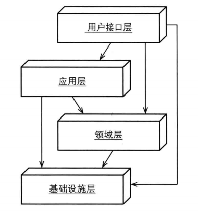
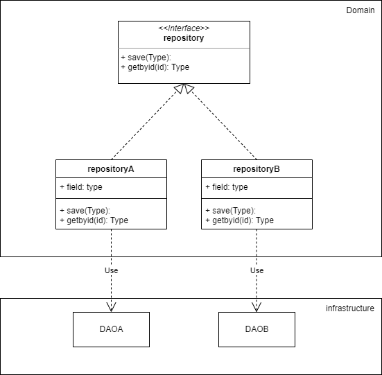

# 001

传统分层架构（以松散分层架构为例）




每层都与下方层发生耦合，依赖下方层的接口。

这在理解上是比较简单和“理所当然”的

例如，我在领域层调用基础设施层的某个接口

```go
inf.Min(a,b)
```


该模式的缺点或挑战在于，对底层的依赖较重，或者说，底层的实现已经渗透到上层了。

例如，资源库（repository）的实现必然受到基础设施层的限制，对于资源库来说，其服务的对象是聚合，聚合一定是定义在领域层的，那么，要操作聚合的资源库也只能定义在领域层，他的底层依赖是确定的，比如数据库，如果我想更换为内存，则必然要修改位于领域层的资源库，也就是领域层需要感知有什么类型的资源库，如下图，资源库的实现在领域层，通过调用基础设施层的接口。





资源库的改进版见[依赖倒置下的分层架构](../002)


