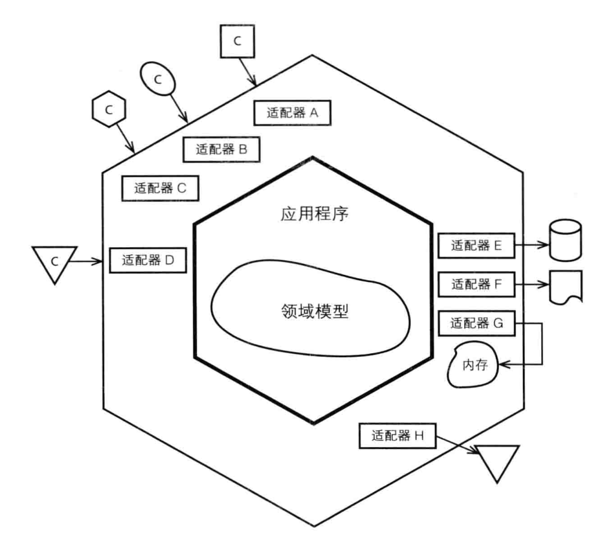
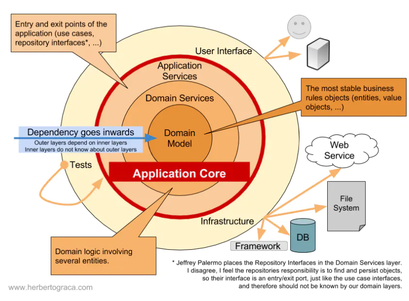
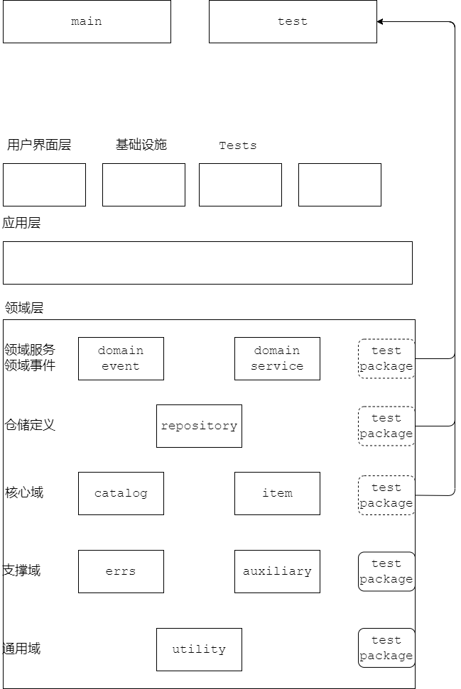

# 003

六边形架构

分层参考洋葱架构

`Tests`可以用于在不依赖外部服务的情况下，对业务领域逻辑进行测试，只需要在依赖注入时将真实的服务替换成Tests。

领域层理论上不会与任何具体的技术实现相耦合，只依赖接口，接口通过最外层注入。

对于像go这种支持包测试的，测试文件和当前包放在一起，但是包名不一样，而且在层级上属于最外层。如下

对于每层的任务职责和边界要清晰、明确。不能为了方便把不适合本层做的放在本层，不适合的就上移一层、以此类推。

 

## FAQ

## reference

1. [map types](https://golang.google.cn/ref/spec#Map_types)
