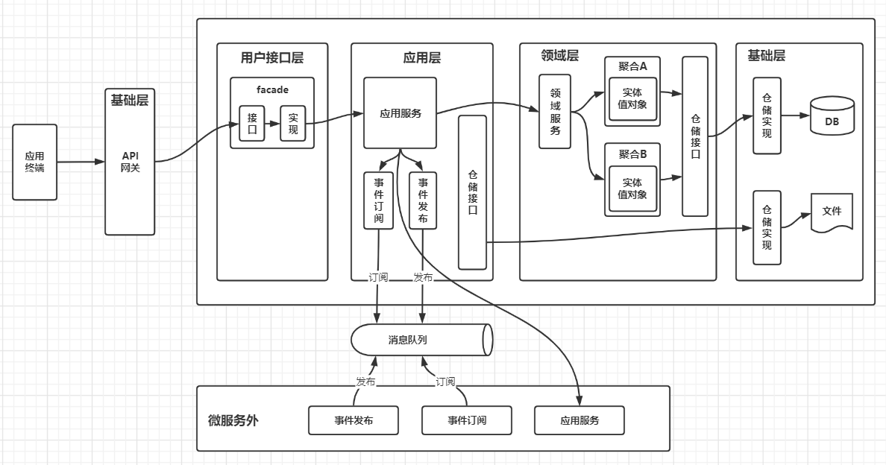

# DDD架构设计与实现

**总结原则**

1. 请求参数必须转化为结构体-因为需要数据校验
2. 领域模型包含所有需要的信息，但是返回数据可以少，见第三条
3. 返回参数可以直接map[string]interface{}
4. 参数校验尽可能往前（一般放在interface层，做绑定的时候校验，这是第一步，其余的在domain层做）
5. 对于资源是否存在的检查应该在domain层，这个属于业务的逻辑

// 错误信息 放在domain层，还是inf层？  领域层，基础设施层可以用error表示，领域层的错误才认为是业务逻辑错误

type ErrorCode struct {

  Code   uint  `json:"code"`   // 错误码

  Message string `json:"message"` // 错误信息

}

## 概念

> DDD最大的好处是：接触到需求第一步就是考虑领域模型，而不是将其切割成数据和行为，然后数据用数据库实现，行为使用服务实现，最后造成需求的首肢分离。DDD让你首先考虑的是业务语言，而不是数据。**DDD强调业务抽象和面向对象编程，而不是过程式业务逻辑实现。**重点不同导致编程世界观不同。

> 1.面向对象设计，数据行为绑定，告别贫血模型。
> 2.优先考虑领域模型，而不是切割数据和行为。
> 3.业务语义显性化，准确传达业务规则。
> 4.代码即设计，通过领域设计即可很清晰的实现代码。
> 5.它通过边界划分将复杂业务领域简单化，帮我们设计出清晰的领域和应用边界，可以很容易地实现业务和技术统一的架构演进。

> 领域驱动设计，又称"软件核心复杂性应对之道"。是一套基于对象思维的业务建模设计思想，相对于 CRUD 系统有更高的灵活性，是业务人员处理复杂问题的有效手段。
> ————————————————
> 版权声明：本文为CSDN博主「靖节先生」的原创文章，遵循CC 4.0 BY-SA版权协议，转载请附上原文出处链接及本声明。
> 原文链接：https://blog.csdn.net/m0_37583655/article/details/117565641

领域驱动自己理解的是：带有明确边界的、以业务领域驱动的设计模型。

仓储：定义在领域层，实现在基础设施层（需要依赖倒置）

仓储的行为需要符合业务逻辑（存疑）

## 用户界面层-interface

负责外部数据到内部数据的转换，包括通信机制（RESTful，gRPC等）和数据形式（JSON，XML等），需要考虑到不同形式间的可替换性，或者共存。

使用的数据为：

**DTO**（Data Transfer Object）：数据传输对象，本意是指通过某种通信机制传输的数据。

> 泛指用于展示层与服务层之间的数据传输对象

> 用户界面层只用于处理用户显示和用户请求，它不应该包含领域或业务逻辑。用户界面所进行的验证和对领域模型的验证是不同的。

TODO: 数据复用问题

#### 功能

应该只做简单的参数获取和校验，

1. ~~资源判断：如果url指定了某一资源，需要判断该资源类型（有可能同样格式的ID代表了不同类型，如inode对应的文件和文件夹），以及该资源否存在~~

2. 参数校验：go中是将JSON数据绑定到结构体中，并做参数校验。~~根据第一条，不同的资源类型需要绑定不同的结构体~~（不是好的接口设计，该层不应该判断id类型）

## 应用层-application

负责工作流、数据转换和事件管理的角色

- 工作流

  应用服务的功能
  
- 数据转换

  DTO和DO的转化

- 事件

  发布和订阅事件

不应该存在DO不需要的DTO数据字段，若存在需要修改API的定义

如果存在DO需要但是DTO没有的数据字段（可通过其他字段经过转化或计算得到）的，还比如id

> 应用服务和领域服务是不同的，因此领域逻辑也不应该出现在应用服务中。应用服务可以用于控制持久化事务和安全认证，或者向其他系统发送基于时间的消息通知，它主要用于协调对领域对象（比如聚合）的操作，同时，应用服务是表达用例和用户故事的主要手段。其主要用途是：接收来自用户界面的输入参数，再通过资源库获取到聚合实例，然后执行响应的命令操作。

## 领域层-domain

业务核心，定义业务的领域对象：

**DO**（Domain Object）：领域对象

> 从现实世界中抽象出来的有形或无形的业务实体

领域层由聚合根聚合出来的限界上下文组成，并包含领域服务（注意和应用服务区分）

领域服务可参考go标准库，例如URL，其中的`Parse`和`ParseRequestURI`可以认为是领域服务

一个领域对象（聚合根）由可修改的配置和不可修改的信息聚合而成

聚合根和聚合根之间的关联   通过id关联引用

不能在一个聚合根里操作另一个聚合根

## 基础设施层-infrastructure

严谨意义上只包含一些组件的功能封装，一些通用的函数不应在此，可放置于领域层的通用子域中。

**PO**（Persistent Object）：持久化对象

> 它跟持久层（通常是关系型数据库）的数据结构形成一一对应的映射关系，如果持久层是关系型数据库，那么，数据表中的每个字段（或若干个）就对应PO的一个（或若干个）属性。

GetCatalogs和CatalogsGet区别

GetCatalogs 从面向对象角度来讲是获取catalogs对象

CatalogsGet 从面向对象角度来讲是catalogs对象获取其中参数

## DDD相关概念

### 实体

**Entity**

实体是唯一的且可持续变化的。意思是说在实体的生命周期内，无论其如何变化，其仍旧是同一个实体。唯一性由唯一的身份标识来决定的。可变性也正反映了实体本身的状态和行为。

持久化时可通过id被定位到

？实体和实体之间的关系

### 值对象

**Value Object**

一个值附带操作方法，不可变。

持久化时通常附于实体的某一列中，通过实体获取该值。

### 聚合

**Aggregate**

聚合是领域对象的显式分组，旨在支持领域模型的行为和不变性，同时充当一致性和事务性边界。

### 领域和子域

领域是一个边界内的业务范围及其所进行的活动，然而，一个领域可能会涉及多个方面，那么就还需要将领域拆分，而不是一个领域模型完成所有领域功能。

拆分的子域有以下几类：

- 核心域（Core or Basic）
- 支撑子域（Auxiliary or Support）
- 通用子域（Generic）被用于整个业务系统，在最低层。目前不好分类的一些通用函数放在`utility`目录下（util）

### 领域事件

**Event**

一般都是通用的流程，只是根据不同的事件发送的消息体不一致，如语言支持泛型可用泛型实现。

### 工厂

**Factory**

### 仓储

**Repository**

> 严格来讲，只有聚合才拥有仓储

## 设计步骤

设计过程从架构图上看是一个由下到上，由内到外的过程，领域层是最先需要被确定的，边界一定要划分清楚

1. 以领域对象为基础，首先设计领域层的聚合，例如

2. 根据需求确定需要的应用服务，并以API的形式提供

## FAQ

1. 基础参数校验，业务参数校验，权限检查，入口记录和审计等在哪里做
   - 基础参数有成熟的框架`validator`，gin框架中也已经集成
   - 业务参数在domain层做，有两种方式：“饿汉式”和“懒汉式”，一种是在进入domain层就做检查，另一种是在不得不做时才做检查。尽量减少重复校验。
   - 权限检查
   - 入口记录

2. 模块功能初始化位置问题，每个层可能都有该功能的初始化，例如接口层要初始化路由，领域层要初始化配置等，

   - 按层分，例如在路由初始化里分别判断各个模块是否支持，并初始化
   - 按能力分，例如在main中，如果该模块支持，则先初始化该模块用到的路由，再初始化该模块用到的领域层

   

错误处理逻辑哪层处理   （返回到哪层）

## 附录

UI DTO设计

需考虑问题：

结构体定义以及 部分编辑问题

调用其他微服务在什么地方-目前在领域层

设计步骤：

如果从页面走下来，很容易受DTO影响，领域模型变成了对DTO的封装

应该先进行领域划分，确定领域模型，再将领域模型转化为DTO（领域模型固定，DTO动态的要什么给什么，不用额外定义结构体）

## reference

1. [Golang 项目架构](https://learnku.com/go/t/43569)
2. [Go项目架构指南](https://cloud.tencent.com/developer/article/1624626)
3. [go路线](https://learnku.com/articles/56078)
4. [DDD-经典四层架构应用](https://blog.csdn.net/whos2016/article/details/103927879)
5. [浅析VO、DTO、DO、PO的概念、区别和用处](https://www.cnblogs.com/qixuejia/p/4390086.html)
6. [dao-repositories-and-services-in-ddd](https://stackoverflow.com/questions/19935773/dao-repositories-and-services-in-ddd)
7. [DDD之4聚合和聚合根](https://zhuanlan.zhihu.com/p/146488464)
8. [DDD领域驱动设计实战-理解聚合(Aggregate)和聚合根(AggregateRoot)](https://cloud.tencent.com/developer/article/1791310)
9. [DDD理论学习系列——案例及目录](https://www.jianshu.com/p/6e2917551e63)
10. [DDD—分层架构、洋葱架构、六边形架构](https://www.cnblogs.com/jiyukai/p/14830869.html)
11. [RESTful API 规范](http://restful.p2hp.com/)
12. 微服务架构设计模式 机械工业出版社
13. 实现领域驱动设计 电子工业出版社
14. [domains-and-subdomains](https://thedomaindrivendesign.io/domains-and-subdomains)
15. [domain-driven-design-ddd](https://www.geeksforgeeks.org/domain-driven-design-ddd/)
16. [DDD领域驱动设计详解](https://blog.csdn.net/m0_37583655/article/details/117565641)

