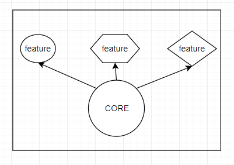
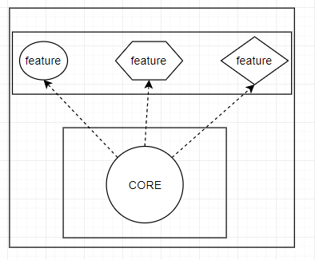

# 501

function extension - built-in or self-registering plugin

功能扩展主要针对那些流程大致相同、相互独立的模块，例如内核的驱动和 wireshark 的协议解析

扩展分为两种模式
第一种是可以获取源代码，对源代码进行扩展，也即在基础功能上进行定制特性，核心 CORE 在兼容的情况下可以进行升级，最终是以一个整体发布，这种模式是 built-in 模式

第二种是可以在没有源码的情况下，依据一些约定，将特性单独生成、放置。最终是两部分，组成一个整体，这种模式是 plugin 模式

## 实例分析

### linux 内核驱动

#### built-in

使用了 initcall 机制，在内核镜像文件中，自定义一个段，这个段里面专门用来存放这些初始化函数的地址，内核启动时，只需要在这个段地址处取出函数指针，一个个执行即可。(详见参考)

#### plugin

使用 insmod 动态加载

### wireshark 协议解析

核心功能提供了注册的功能，提供注册并管理注册的协议。详见 epan_init 函数

#### built-in

最底层使用了全局数组初始化的方式。 使用脚本将所有的协议代码集合起来。详见 make-regs.py

之后就可以从初始化好的数组中取数据进行注册了

#### plugin

约定模块的通用函数名称，通过动态加载（例如 dlopen）读取插件文件并执行通用函数。在 wireshark 里这是一种自注册插件（self-registering plugin）的方式，通过通用函数向核心功能进行注册。

## go 语言实现

#### built-in

go 的 init 函数可以很方便的实现扩展的 built-in 功能

##### golang 程序初始化(参考3)

> golang 程序初始化先于 main 函数执行，由 runtime 进行初始化，初始化顺序如下：
>
> 1. 初始化导入的包（包的初始化顺序并不是按导入顺序（“从上到下”）执行的，runtime 需要解析包依赖关系，没有依赖的包最先初始化，与变量初始化依赖关系类似，参见 golang 变量的初始化）；
> 2. 初始化包作用域的变量（该作用域的变量的初始化也并非按照“从上到下、从左到右”的顺序，runtime 解析变量依赖关系，没有依赖的变量最先初始化，参见 golang 变量的初始化）；
> 3. 执行包的 init 函数；

当 import 一个模块时，首先会执行该模块的全局变量赋值操作，再执行模块里的所有 init 函数（模块内可存在多个 init 函数）

#### plugin

## reference

1. [wireshark - How packet dissection works](https://www.wireshark.org/docs/wsdg_html_chunked/ChapterDissection.html#ChDissectWorks)
2. [linux 的 initcall 机制](https://www.cnblogs.com/downey-blog/p/10486653.html)
3. [golang的init函数](https://zhuanlan.zhihu.com/p/34211611)
