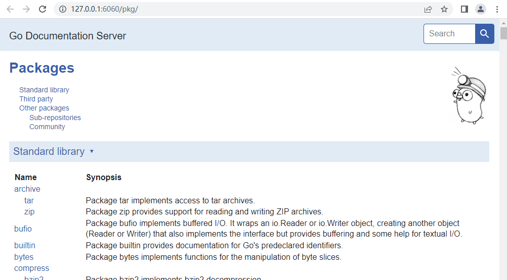

# 503

go doc

`go doc`命令可以通过代码的注释生成说明文档，类似`doxygen`的功能。

`go doc`对注释的格式也有一定的要求，说明如下：

注释文档可以对package、const、func、type和var进行说明，注释要紧挨着被注释符号，不能有空行分隔，每一个要导出的符号都需要有文档注释。


## Packages

每个package都需要有一个注释说明这个package，它的信息和能做什么


## Commands

command的注释和package类似，只不过是对main的注释，它注重描述命令的行为，和命令的帮助信息类似，下面是一个gofmt的注释文档

```go
/*
Gofmt formats Go programs.
It uses tabs for indentation and blanks for alignment.
Alignment assumes that an editor is using a fixed-width font.

Without an explicit path, it processes the standard input. Given a file,
it operates on that file; given a directory, it operates on all .go files in
that directory, recursively. (Files starting with a period are ignored.)
By default, gofmt prints the reformatted sources to standard output.

Usage:

    gofmt [flags] [path ...]

The flags are:

    -d
        Do not print reformatted sources to standard output.
        If a file's formatting is different than gofmt's, print diffs
        to standard output.
    -w
        Do not print reformatted sources to standard output.
        If a file's formatting is different from gofmt's, overwrite it
        with gofmt's version. If an error occurred during overwriting,
        the original file is restored from an automatic backup.

When gofmt reads from standard input, it accepts either a full Go program
or a program fragment. A program fragment must be a syntactically
valid declaration list, statement list, or expression. When formatting
such a fragment, gofmt preserves leading indentation as well as leading
and trailing spaces, so that individual sections of a Go program can be
formatted by piping them through gofmt.
*/
package main
```

这样，你对gofmt使用go doc时会出现该信息

```shell
$ go doc gofmt
Gofmt formats Go programs. It uses tabs for indentation and blanks for
alignment. Alignment assumes that an editor is using a fixed-width font.

Without an explicit path, it processes the standard input. Given a file, it
operates on that file; given a directory, it operates on all .go files in that
directory, recursively. (Files starting with a period are ignored.) By default,
gofmt prints the reformatted sources to standard output.

Usage:

    gofmt [flags] [path ...]

The flags are:

    -d
        Do not print reformatted sources to standard output.
        If a file's formatting is different than gofmt's, print diffs
        to standard output.
...
```


## Types


## Funcs


## Consts


## Vars


## Syntax

go doc使用简单的语法分析，它支持paragraphs, headings, links, lists, 和preformatted code blocks，为了保持轻量和较好的可读性，没有支持复杂的特性，像字体和HTML。它更像是Martdown的一个子集。

标准格式化工具 gofmt 会对文档注释重新格式化。

指令注释，像`//go:generate`,不会被认为是注释文档的一部分，

### Paragraphs

段落是一块未缩进的非空行。

### Headings

标题是一个以`#`（1.19）开头的，然后一个空格，接着一段标题文本，并且要和其他段落通过空行分隔。

一些不是标题的示例

```go
// #This is not a heading, because there is no space.
//
// # This is not a heading,
// # because it is multiple lines.
//
// # This is not a heading,
// because it is also multiple lines.
//
// The next paragraph is not a heading, because there is no additional text:
//
// #
//
// In the middle of a span of non-blank lines,
// # this is not a heading either.
//
//     # This is not a heading, because it is indented.
```

### Links


### Doc links


### Lists

缩进的，以某些符号加空格开头的行，分为符号列表(*,+,-)和编号列表(1. 2. 3.)

### Code blocks

代码块是一块缩进的行


## Common mistakes and pitfalls


## go doc

```
go doc [doc flags] [package|[package.]symbol[.methodOrField]]
```

选项

| 选项   | 含义                 |
| ------ | -------------------- |
| -all   | 显示包的所有注释文档 |
| -c     | 对大小写敏感         |
| -cmd   | main包像普通包一样   |
| -short | 一行表述             |
| -src   | 显示全的源码         |
| -u     | 显示未导出的符号     |
|        |                      |
|        |                      |


## godoc

godoc是一个go的注释文档工具，可以提取和生成说明文档。

安装：

```
go get golang.org/x/tools/cmd/godoc
```

使用说明

```
godoc [flag]
```

常用选项

| 选项       | 含义                                                     |
| ---------- | -------------------------------------------------------- |
| -v         | verbose mode                                             |
| -http=addr | http服务地址，比如 :6060，提供了一个本地的官方文档网站。 |
|            |                                                          |

示例：

```
godoc -http=:6060
```

运行一个web服务，文档以网页形式呈现，如下




## reference

1. [Go Doc Comments](https://golang.google.cn/doc/comment)
2. go help doc
3. [godoc使用及配置](https://learnku.com/articles/52567)
