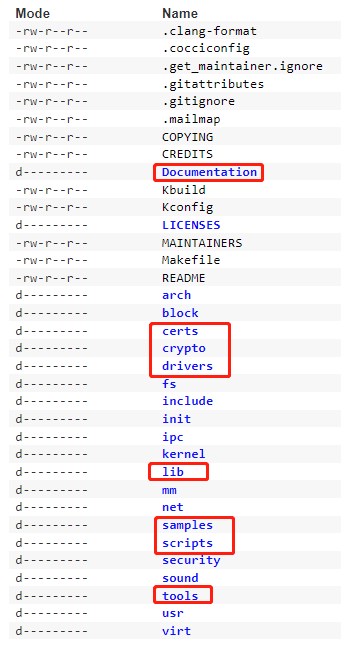
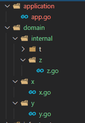
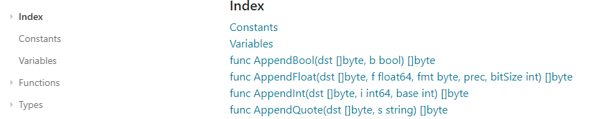
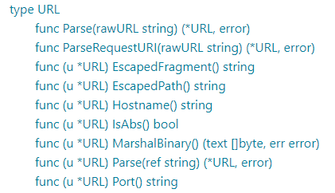

# conventions

即使是内核的源码文件夹，其命名也有让人有疑问的地方，比如为什么有的用复数有的用单数，有一些约定是必要的。

go的一些约定是强制性的，会影响语法，所以有必要在这里做一些总结

172

There's a few guidelines to follow.

1. File names that begin with "." or "_" are ignored by the go tool
2. Files with the suffix `_test.go` are only compiled and run by the `go test` tool.
3. Files with os and architecture specific suffixes automatically follow those same constraints, e.g. `name_linux.go` will only build on linux, `name_amd64.go` will only build on amd64. This is the same as having a `//+build amd64` line at the top of the file

## 名称

### 文件夹名

几个特殊的文件夹

#### internal

`internal`用于保护其下的代码，使其对其他包不可见，只能由它所在的包及其子包使用。

如下，`z`包只能由`domain`包及其子包使用，其他包不可见。详见[参考4][]

#### vendor

Go 1.6支持使用外部依赖的本地拷贝，例如你可以把github上使用的包拷贝到本地。

其使用和`internal`类似，而且使用时不用包含前缀。详见[参考4][]

#### go tool忽略的文件

`testdata`文件夹会被go tool忽略

以`.`和`_`开头的文件和文件夹会被go tool忽略

### 文件名

见[参考1][]

### 包名

### 变量名

## FAQ

1. 函数返回结构体时，每个出错都要构造空结构体，很麻烦
你一定是使用的非命名返回值，可以使用命名返回值，出错时只需要一条简单的不带参数的return语句即可。详见[function](007)

2. `:=`左侧必须都是新的变量吗？

   不是，如果是多变量赋值，只要至少有一个是新变量即可。

3.  文件内各种元素的布局，比如常量、变量、公有函数、私有函数等的放置顺序如何

   可以参考标准库的布局，自己的代码可以在VSCode的**OUTLINE**中可以看到文件的布局

   

   

   

4. 4

5. 5

6. 5

7. 5

8. 5

9. 5

10. 5

11. 5

12. 5

## reference

1. [filename conventions #36060][参考1]
2. [what-are-conventions-for-filenames-in-go][参考2]
3. [names](https://golang.google.cn/doc/effective_go#names)
4. [cmd go][参考4]

[参考1]:https://github.com/golang/go/issues/36060
[参考2]:https://stackoverflow.com/questions/25161774/what-are-conventions-for-filenames-in-go
[参考4]:https://golang.google.cn/cmd/go/